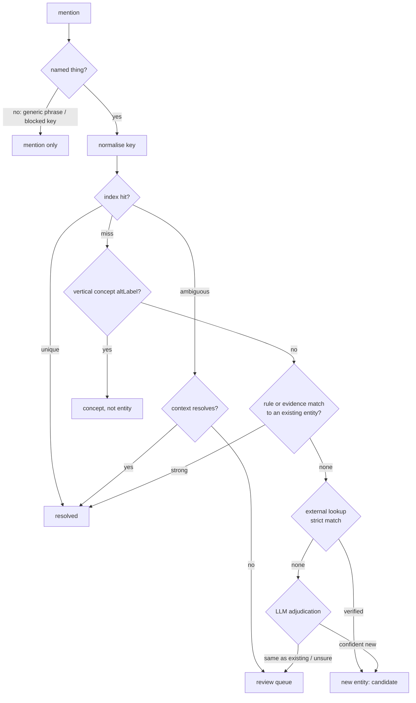

# Entity Registry — Design

Status: Phase 1 built, 13 Sep 2026 (see [§10](#10-phase-1-as-built)). The four decisions in §9
were accepted as proposed.

One durable authority for *which real-world thing a surface form names*, shared by every
site, run and vertical, and built so that every run and every review makes the next
resolution better.

---

## 1. Why

Concepts already have identity: a frozen `id`, a `prefLabel`, a definition and curated
`altLabels` in the vertical profile. **Entities have none.** Today four mechanisms each
do a piece of the job, and none is the authority:

| Mechanism | What it does | What goes wrong |
|---|---|---|
| `page_graph._extract_entities_gliner` | dedups on the raw lowercased span | "Customers" and "customer" are two nodes |
| `site_graph._canonicalize_nodes` | lowercase + strip one of 7 suffixes; first name and type seen win | no plurals, hyphens, `.com`, `Inc`; no alias table |
| `knowledge_graph._ENTITY_ALIASES` | 12 hand-listed vendors | only used for `owl:sameAs` in the page RDF; the site graph never reads it; `resolve_canonical_name()` has no callers |
| `constants.WIKIDATA_KB` | 40 hand-written Q-IDs | 38 were wrong, and nothing checked |

The Ordway site run of 13 Sep 2026 (40 pages) shows the result: 527 nodes, 43 edges,
and about 18 surviving duplicate groups. "Salesforce" / "Salesforce.com" /
"Salesforce CRM" are three nodes, even though that exact example is in the alias
table's own comment. "Amazon" is a Competitor and "Amazon.com" a Software Platform.

Three structural gaps sit under the symptoms:

1. **No identity across runs or sites.** Entity URIs are minted under the audited domain
   (`https://{domain}/entity/...`), so Stripe on ordwaylabs.com and Stripe on
   chargebee.com are different resources. `graph_store.diff_runs` compares exact
   strings, so a respelling between runs reads as one claim removed and another added.
2. **Type is confused with role.** "Competitor" and "Integration Partner" are not
   what Stripe *is*; they are how one site relates to it. Storing role as type is why
   the same company gets contradictory types on different pages.
3. **The system cannot learn.** `POST /api/ontology/approve-synonym` writes the vertical
   file and `truth_ledger/alt_label_candidates.json` on the instance's local disk and
   never calls `vertical_store.publish`. On Cloud Run every reviewer decision is lost
   when the instance recycles. Lookup results live in a per-process dict.

## 2. Principles

1. **Identity is ours; external IDs are attributes.** Most entities that matter for our
   customers (small vendors, the audited brand itself) are not on Wikidata. Identity
   cannot depend on it.
2. **A wrong merge is worse than a duplicate.** A duplicate is visible and cheap to fix;
   a false merge silently corrupts every graph that uses it. Deterministic rules only
   auto-merge into entities that already exist; anything similar-but-unproven is
   proposed, not applied.
3. **Nothing is decided twice.** Every resolution, approval and rejection is stored
   and read by the next run. That covers negative knowledge too: "Google ≠ Google Cloud",
   "Color is not an entity here".
4. **Cheap first, expensive only for the residue.** Index lookup → rules → evidence →
   external lookup → LLM → human. The share handled by the first rung should rise
   run over run. That is the learning metric.
5. **Build against the interface, test curated and cold.** Every phase is measured on
   ordwaylabs.com (curated vertical, ground truth available) *and* a cold domain
   (chargebee.com). The gap between them is reported, not hidden.

## 3. What the registry holds

### 3.1 Three kinds of thing, kept apart

| Thing | Example | Lives in | Identity |
|---|---|---|---|
| **Concept** | Usage-Based Pricing, Dunning | vertical profile (unchanged) | `concept_uri(vertical, id)` |
| **Entity** | Stripe, QuickBooks, SOC 2, Ordway | **entity registry (new)** | `https://gainark.com/ontoleap/entity/{id}` |
| **Mention** | "new customers", "industry" | the run only | none — not exported as a node |

Standards sit on the boundary. SOC 2 is a real-world named thing (the registry) *and*
a concept in two verticals with `governs` edges (the profiles). The concept gains an
optional `entity_ref`; the registry entity lists the concepts that reference it. One
identity, and the vertical's curated semantics stay where they are.

### 3.2 Entity record

```jsonc
{
  "id": "ent-stripe",                       // frozen slug, never re-derived from a label
  "status": "active",                       // candidate | active | merged | rejected
  "merged_into": null,                      // set when status = merged; old ids keep resolving
  "kind": "organization",                   // organization | product | standard | topic | place
  "prefLabel": "Stripe",
  "definition": "Payment infrastructure company providing card processing and billing APIs.",
  "aliases": [
    {"form": "Stripe, Inc.", "source": "wikidata", "added": "2026-09-14"},
    {"form": "Stripe Payments", "source": "curated", "added": "2026-09-14"},
    {"form": "stripe.com", "source": "observed", "sites": 7, "added": "2026-09-20"}
  ],
  "domains": ["stripe.com"],               // strongest identity key an organization has
  "part_of": null,                          // product -> organization, e.g. QuickBooks -> Intuit
  "parent_org": null,                       // ownership, e.g. TaxJar -> Stripe
  "external": {
    "wikidata": {"qid": "Q7624104", "verified": "2026-09-14", "method": "label+website"},
    "linkedin": null, "crunchbase": null
  },
  "distinct_from": ["ent-stripe-atlas"],   // negative knowledge: never merge these
  "evidence": {"sites": 7, "mentions": 212, "first_seen": "...", "last_seen": "..."}
}
```

`kind` is intrinsic and closed. **Roles** (integratesWith, competesWith, compliesWith)
stay on edges in the run graph, where they already are, so Amazon can be a competitor
to one site and an integration of another without contradiction.

### 3.3 Surface-form index

A derived table, not a source of truth: `normalised key → [(entity_id, confidence,
context_constraint)]`.

- Most keys map to one entity.
- Ambiguous keys ("Sage", "Discover", "Oracle", "Square") map to several, with context
  constraints (kind, co-occurring terms, vertical). The resolver must use context
  or refuse.
- Blocked keys ("customers", "platform", "cloud") map to *not an entity*, learned from
  review, so the same generic phrase is never proposed again.

## 4. Resolution pipeline

Extraction stops producing final nodes. It produces **mentions**:
`(surface form, extractor label, sentence, page url, link href if the span is anchor
text)`. The resolver turns a run's mentions into entity ids in one batch.



| Rung | Method | Auto-applies? |
|---|---|---|
| 0 | **Named-thing filter.** Extractor label prior, determiners, lowercase common-noun plurals, learned blocked keys | drops to mention |
| 1 | **Normalise.** Unicode, case, whitespace, hyphen = space, possessive, leading article, legal suffix (Inc, LLC, Ltd, plc), trailing TLD; singularise multi-word common-noun phrases only (never proper names: "Sales**force**", "Adyen") | key only; display form kept as an alias |
| 2 | **Index lookup** (approved aliases, context constraints for ambiguous keys) | yes |
| 3 | **Concept check.** Vertical `altLabels` via the existing `_alias_index` | routes to concept |
| 4 | **Rules and evidence against existing entities.** Product-word suffix (" CRM", " Online", " Cloud") *only if the remainder is an active entity and no `distinct_from` blocks it*; anchor href to an entity's registered domain | yes when strong; otherwise review |
| 5 | **External lookup.** Wikidata search, accepted only when the label or an alias equals the form, P31 fits `kind`, and (for organizations) official website P856 matches a seen domain when one exists. Persisted, once per key globally | creates a *candidate* |
| 6 | **LLM adjudication.** Gemini gets the mention sentences, candidate definitions and `distinct_from`, and returns same / different / not-an-entity with reasons | new candidates yes; **merges into existing entities never** |
| 7 | **Review queue** | human |

Every resolution is written with `method`, `confidence` and the evidence used, so a
bad outcome can be traced to the rung that produced it.

## 5. How the process gets smarter

The registry is data *and* the resolver's memory. Each loop below turns one run's work
into the next run's cheap path.

| Signal | Written as | Effect next run |
|---|---|---|
| Reviewer approves "Salesforce CRM" → Salesforce | alias, `source: reviewer` | rung 2 hit; never queued again |
| Reviewer rejects Google ⇄ Google Cloud | `distinct_from` on both | rung 4 and rung 6 are blocked from proposing it |
| Reviewer marks "Color" not-an-entity (in context) | blocked key with constraint | rung 0 drops it |
| Same form resolves to the same entity on N independent sites by strong methods | alias `sites` count | **auto-promote** candidate → active at a threshold (start N = 3, no conflicts) |
| Wikidata match verified | aliases and domains imported | future variants hit rung 2 without a lookup |
| LLM proposal later approved or rejected | per-method outcome | **calibration**: a method's auto-accept threshold rises when its approvals fall |
| Discovery of a cold domain | candidate entities with evidence | the next site in that category starts with them |

**Measured, not assumed.** A gold set is drawn from Ordway (reviewable by Sree against
the 818-article support corpus) and extended with each approved review. Each run
reports:

- **resolution ladder:** share of mentions resolved at each rung. Rung 2 should grow;
  rungs 5–7 should shrink.
- **precision per method** on the gold set, and review approval rate per method.
- **duplicate groups per graph:** today's Ordway baseline is ~18, and must go down
  without false merges.
- **curated vs cold gap:** the same numbers for ordwaylabs.com and chargebee.com.

## 6. Storage

The registry is mutable, and the archive has no compare-and-set. Last-writer-wins, as
`vertical_store` accepts, would silently drop reviewer decisions — exactly the failure
this design exists to fix. So the registry uses **the same shape that made run history
safe: append-only immutable objects.**

- **Event log** in the existing archive (`ONTOLEAP_GRAPH_ARCHIVE`), one object per
  event under `registry/events/{ulid}.json`: `entity_created`, `alias_added`,
  `alias_removed`, `merged`, `unmerged`, `distinct_from_added`, `blocked_key_added`,
  `external_linked`, `promoted`, `rejected`. Concurrent instances cannot conflict:
  every event has its own key.
- **Materialised snapshot** in SQLite (the local index `graph_store` already uses),
  rebuilt by folding events in ULID order and refreshed with the same startup and TTL
  pattern as `sync_from_archive` and `vertical_store.sync_down`. A periodic compacted
  snapshot object keeps cold start cheap.
- **Conflicts resolve at fold time with explicit rules:** `distinct_from` beats `merged`;
  a reviewer beats automation; a later reviewer beats an earlier one. Nothing is lost,
  because the losing event is still in the log.
- **Merges never delete.** A merged id keeps resolving through `merged_into`, so stored
  run graphs stay valid, and an unmerge is one event.
- **One review queue.** It moves to the archive too and covers both concept synonym
  candidates and entity decisions, which fixes the lost-approvals bug.

## 7. Integration

| Today | After |
|---|---|
| `page_graph` / `document_graph` produce `KGNode`s | produce mentions; nodes come from the resolver |
| `site_graph._canonicalize_nodes` | `registry.resolve_batch(mentions, vertical_id)` |
| entity URI `https://{domain}/entity/...` | shared `https://gainark.com/ontoleap/entity/{id}`; the run graph keeps roles on edges |
| `WIKIDATA_KB`, `_ENTITY_ALIASES` | loaded **once** as bootstrap events (`source: curated`), then deleted |
| `entity_grounding` in-process cache | becomes rung 5, persisted as `external_linked` events |
| `sector_ontology` candidate file on local disk | the unified archive-backed review queue |
| `diff_runs` on raw strings | diffs on entity ids, following `merged_into` |
| schema `sameAs` | read from `external` (Wikidata, and LinkedIn/Crunchbase for brands) at page-schema time; a missing one is looked up then and written back |
| — | `vendors_covering`-style questions for entities: "which audited vendors integrate with Stripe" |

New endpoints: `GET /api/entities/{id}`, `GET /api/entities/resolve?q=`,
`GET /api/review/queue`, `POST /api/review/{item}/decide`.

## 8. Phases

Each phase ships on its own and is judged by a full end-to-end run on ordwaylabs.com
and chargebee.com, not by unit tests alone.

1. **Registry core.** Event store and snapshot, entity model, bootstrap from the two
   existing tables, rungs 0–4, wired into `site_graph`. Success: Ordway duplicate
   groups drop from ~18 with zero false merges on the gold set; stable ids survive
   two runs; `diff_runs` on ids.
2. **Evidence and external identity.** Anchor-href domains, persisted Wikidata rung
   with the strict match, kind/role split in exports, brand `sameAs` from official
   profiles.
3. **Review and learning.** Unified archive-backed queue, decisions folded into the
   index, `distinct_from` and blocked keys, auto-promotion by cross-site evidence,
   the per-run learning metrics.
4. **LLM adjudication and calibration.** Rung 6 for the residue, per-method precision
   against the gold set moving auto-accept thresholds.

## 9. Decisions needed

1. **Product vs organization granularity.** Proposal: resolve to the organization by
   default ("Salesforce CRM" → Salesforce). Mint product entities only where the
   product is what customers integrate with and it has its own identity (QuickBooks →
   `part_of` Intuit; Sage Intacct → `part_of` Sage Group).
2. **Mentions in exports.** Proposal: generic mentions leave the exported graph and
   JSON-LD (roughly 160 of today's 527 nodes) but stay in the run record for coverage
   scoring.
3. **Auto-promotion threshold.** Proposal: 3 independent sites, strong methods only, no
   conflicting review.
4. **Who reviews and where.** Proposal: Sree, in a review panel on the existing
   dashboard, ordered by how many graphs each decision would change.

All four accepted as proposed, 13 Sep 2026.

## 10. Phase 1 as built

| Piece | Where |
|---|---|
| Entity model, event fold, archive-backed store, run observations | `entity_registry.py` |
| Curated seed: 41 entities (20 organizations/products, 13 standards, 8 topics) | `registry/seed_entities.json` |
| Normalisation, common-noun test, resolution ladder, site resolution | `entity_resolver.py` |
| Site graph on resolved identities; JSON-LD and Turtle on node ids | `site_graph.assemble_site_kg` |
| Coverage reads mentions as well as nodes | `industry_ontology.align_graph_with_industry` |
| Offline invariants | `test_entity_registry.py` |
| Seed Q-IDs checked against live Wikidata | `test_wikidata_kb_live.py` |
| Replay of stored crawls, before vs after | `eval/registry_replay.py`, `eval/entity_gold.json` |

### Where it departs from the proposal, and why

- **`topic` is a kind.** SaaS, ERP, revenue recognition and usage-based pricing have
  external identity but are neither organizations nor standards, and several are
  concepts in more than one vertical. A vertical concept that a registry entity also
  names now resolves to the entity, with the concept kept as `skos:exactMatch`. Without
  that, "Revenue recognition" (topic) and "Revenue Recognition" (concept, reached through
  the alternate label "Automated Revenue Recognition") were two nodes on every Ordway run.
- **The seed is a file, not bootstrap events.** It is curated, reviewed in git, identical
  on every instance and folded first, so there is nothing to race on and no archive
  read at cold start. Events in the archive hold only what changes at runtime.
- **The resolver's rungs are numbered for what runs.** Phase 1 runs group → registry →
  concept → brand → suffix → mention → observed. Anchor-href evidence, Wikidata lookup,
  LLM adjudication and review arrive in phases 2–4.
- **The audited brand is identified by its domain** as `org-{domain}` in the shared
  entity namespace, even when the registry has no entry for it. That id is deterministic,
  so it is stable across runs, and it is the id a later promotion will write. A name
  plus a common domain affix finds it: "Ordway" on ordwaylabs.com. A form that reached
  the brand through a product word ("Chargebee Billing") does not name it.
- **Each run writes one observation object** (`registry/observations/`): every form, how
  it resolved and by which rung. Phase 3's cross-site promotion reads these, so the
  evidence starts accumulating now rather than being rebuilt later from graphs that lost
  the detail. Written only when a crawl persists; replays do not write.
- **`WIKIDATA_KB` and `_ENTITY_ALIASES` are not deleted yet.** The site graph no longer
  reads them, but the page-level graph (`page_graph`) and the drift pipeline
  (`knowledge_graph`, `link_prediction`, `pipeline`) still do. They go when those move
  onto the resolver.
- **Event ids carry a per-process sequence** after the millisecond timestamp. The test
  suite caught an alias folding before the entity it belonged to: both events were
  written in the same millisecond and random noise decided their order.

### Measured on stored crawls

Replayed through `assemble_site_kg` from the job state kept in the archive, so both
columns read identical pages:

| Crawl | Nodes before → after | Duplicate groups | Gold violations | Coverage |
|---|---|---|---|---|
| ordwaylabs.com, 40 pages | 527 → 279 (+223 mentions) | 15 → 0 | 18 → 0 | 56.1% → 56.1% |
| ordwaylabs.com, 6 pages | 116 → 63 (+61 mentions) | 2 → 0 | 8 → 0 | 36.0% → 36.0% |
| chargebee.com, 40 pages | 461 → 244 (+204 mentions) | 17 → 0 | 10 → 0 | 47.4% → 47.4% |
| zenskar.com, 40 pages | 168 → 75 (+96 mentions) | 7 → 0 | 6 → 0 | 39.5% → 39.5% |

- Covered concepts, compliance and integrations are identical before and after on every
  crawl, not just the percentage.
- Between the 6-page and 40-page Ordway crawls, all 141 forms both contain keep the same
  id, and the stored-run diff drops from +22 −2 to +21 −0: the two removals were
  respellings.
- `sameAs` links: 26 → 29 on Ordway. The baseline's page nodes still carried the Q-IDs
  from before the 13 Sep fix, which the old canonicaliser trusted; the resolver reads
  the registry only.
- **The gold set is not independent.** It was drafted from reading this output, so
  passing it shows the resolver does what was judged right, and it guards against
  regression. Sree's review of `eval/entity_gold.json` is what makes it ground truth.
- **Mentions include concept candidates.** About 40% of forms are unresolved common-noun
  phrases. Most are generic ("new customers", "billing portal"), but some are domain
  terms the vertical lacks ("direct debit", "matrix pricing", "dunning sequences"). They
  are out of the export and still in coverage and in the run observation, which is
  where phase 3 proposes them as concepts.
