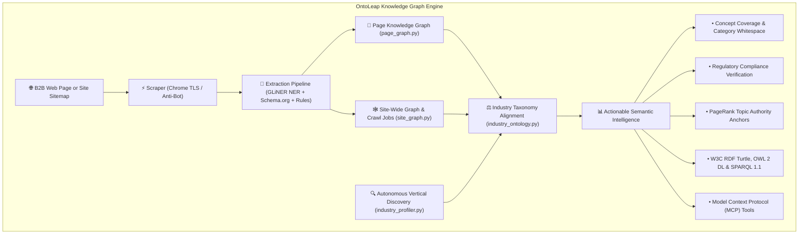

# GainARK OntoLeap (v2.2)
> **Autonomous Ontology Intelligence, Zero-Shot Entity Grounding, Relational Triples Extraction, & Semantic Graph Engine for B2B SaaS**

[](https://www.python.org/downloads/)
[](https://fastapi.tiangolo.com/)
[](https://github.com/urchade/GLiNER)
[](https://cloud.google.com/run)
[](LICENSE)

---

## 🚀 Live Production Deployment

GainARK OntoLeap is live on **Google Cloud Run**:
- **Executive Dashboard UI**: [https://gainark-ontoleap-35509275124.asia-south1.run.app/dashboard](https://gainark-ontoleap-35509275124.asia-south1.run.app/dashboard)
- **Interactive Swagger API Docs**: [https://gainark-ontoleap-35509275124.asia-south1.run.app/docs](https://gainark-ontoleap-35509275124.asia-south1.run.app/docs)
- **Service Health & Diagnostics**: [https://gainark-ontoleap-35509275124.asia-south1.run.app/api/info](https://gainark-ontoleap-35509275124.asia-south1.run.app/api/info)

---

## 🎯 The Problem Solved

Modern AI systems and LLM workflows suffer from hallucinations and ungrounded assertions when reasoning about B2B companies, product capabilities, and industry standards. Flat text dumps and unstructured vector embeddings lack relational semantics, hierarchy, and deterministic validation.

**GainARK OntoLeap** transforms raw B2B websites and documentation into deterministic, verified **Knowledge Graphs**:
- **Entity Grounding**: Binds identified entities to authoritative global identifiers (Wikidata Q-IDs) and Schema.org types.
- **Relational Triples**: Mines precise $\langle \text{Subject}, \text{Predicate}, \text{Object} \rangle$ facts backed by verbatim sentence evidence.
- **Industry Reference Ontologies**: Benchmarks company capabilities against formal SKOS concept taxonomies (preferred labels, alt labels, and concept hierarchies).
- **Category Whitespace vs. Proprietary Jargon**: Deterministically calculates which standard industry concepts a site omits, and which unique capabilities it invents.
- **Standards-Compliant Exports**: Emits W3C RDF Turtle (`.ttl`), OWL 2 DL (`.owl`), and N-Triples ready for enterprise graph databases and SPARQL 1.1 query engines.



---

## 🏗️ Core Engines & Architecture

### 1. 📄 Page Knowledge Graph Engine (`page_graph.py`)
- **API Endpoint**: `POST /api/kg/page` & `POST /api/page-knowledge-graph`
- Extracts named entities with GLiNER transformer (`urchade/gliner_small-v2.1`).
- Resolves entity grounding against curated and live Wikidata Q-IDs (`entity_grounding.py`).
- Mines high-confidence relational triples with evidence sentences (`automates`, `integratesWith`, `compliesWith`, `hasCustomer`, `supportsPricingModel`).
- Serializes the extracted page graph into W3C JSON-LD and RDF Turtle.

### 2. 🕸️ Site-Wide Knowledge Graph & Resumable Crawl (`site_graph.py`, `crawl_jobs.py`)
- **API Endpoints**: `POST /api/kg/site`, `POST /api/kg/site/jobs`, `POST /api/kg/site/jobs/{id}/advance`
- Traverses sitemaps and domain links with anti-bot resilience and rate limiting.
- Runs long-running site crawls as **resumable background jobs** with discrete batch steps to stay well within Cloud Run execution ceilings.
- Canonicalizes entity nodes across pages, merges aliases, and calculates NetworkX PageRank authority hubs.

### 3. 🌐 Autonomous Industry Profiler & Vertical Store (`industry_profiler.py`, `vertical_store.py`)
- **API Endpoints**: `POST /api/discover-industry`, `GET /api/verticals`
- Zero-shot discovery of vertical taxonomy for any B2B domain using Gemini Flash + Wikidata entity resolution.
- Reads buyer evidence, target segments, compliance requirements, and market competitors directly from candidate pages.
- Dynamically registers and persists discovered industry verticals across server restarts (`vertical_store.py`).

### 4. 📚 Industry Reference Ontologies & Governance (`industry_ontology.py`, `compliance_ontology.py`)
- **API Endpoints**: `GET /api/kg/industries`, `GET /api/kg/industry/{id}`, `POST /api/kg/align`, `GET /api/compliance-frameworks`
- Curated SKOS reference taxonomies for Fintech/Billing, Cybersecurity, DevSecOps, Healthcare, and HR/Payroll.
- Supports robust synonym matching via `prefLabel` and `altLabel` dictionaries (e.g. recognizing "Order-to-Revenue" as coverage for "Quote-to-Cash").
- Tracks multi-step compliance specifications (SOC 2, HIPAA, GDPR, ISO 27001, ASC 606).
- Provides synonym governance review queue (`/api/candidates` and `/api/approve-synonym`).

### 5. 🔮 Graph Reasoning, SPARQL & Exports (`graph_engine.py`, `link_prediction.py`)
- **API Endpoints**: `POST /api/sparql`, `POST /api/export-owl`, `POST /api/export-ntriples`, `POST /api/predict-links`
- Live SPARQL 1.1 query engine executing directly over RDF graph stores.
- Generates formal W3C OWL 2 DL ontologies with `owl:inverseOf` symmetry, domain/range constraints, and SKOS class hierarchies.
- Predicts missing graph relations using ontological priors and transitivity rules.

### 6. 🤖 Official Model Context Protocol (MCP) Gateway (`mcp_server.py`)
- Exposes OntoLeap directly to AI coding assistants and autonomous agents (Claude Desktop, Cursor, Antigravity) on `stdio` transport:
  1. `ontoleap_build_page_kg`: Extract entities, Wikidata Q-IDs, triples, and RDF Turtle from any URL.
  2. `ontoleap_build_site_kg`: Multi-page domain crawl, entity canonicalization, and schema induction.
  3. `ontoleap_align_industry_ontology`: Benchmark extracted graphs against industry reference taxonomy.
  4. `ontoleap_list_industry_ontologies`: Enumerate available reference models.

---

## 📊 File & Module Map

| File | Layer | Description |
| :--- | :--- | :--- |
| `api.py` | Controller | FastAPI application gateway, CORS, rate limits, request ceilings, and router mounting. |
| `page_graph.py` | Extraction | Page-level Knowledge Graph extraction, entity grounding, and RDF generation. |
| `site_graph.py` | Crawler | Multi-page crawl aggregation, entity canonicalization, and PageRank authority hubs. |
| `crawl_jobs.py` | Async Jobs | Resumable background crawl job coordinator for multi-step site graph synthesis. |
| `industry_ontology.py` | Taxonomy | Industry reference ontologies, SKOS hierarchies, altLabel matching, and concept coverage. |
| `industry_profiler.py` | Discovery | Autonomous zero-shot vertical discovery and buyer evidence analysis via Gemini + Wikidata. |
| `vertical_store.py` | Persistence | Filesystem store for dynamically discovered industry verticals across server restarts. |
| `graph_engine.py` | Graph Core | Decoupled graph query engine, SPARQL 1.1 runner, OWL 2 DL export, and alignment dispatch. |
| `entity_grounding.py` | Grounding | Authority on Wikidata Q-IDs, fast-path curated KB, and bounded live SPARQL resolution. |
| `compliance_ontology.py`| Compliance | Multi-step compliance frameworks (SOC 2, HIPAA, ASC 606, GDPR) and evaluation. |
| `ontology_schema.py` | Schema | Relation definitions, semantic head matching, and domain/range constraints. |
| `link_prediction.py` | Reasoning | Ontological prior-based link prediction for missing graph relations. |
| `pipeline.py` | NLP & Pipeline | GLiNER model loading, Schema.org extraction (`extruct`), and relational triple mining. |
| `scraper.py` | Networking | Anti-bot scraping with Chrome TLS (JA3/JA4) impersonation, SSRF protection, and rate limiting. |
| `mcp_server.py` | MCP Protocol | Official Model Context Protocol stdio server for Claude Desktop, Cursor, and AI agents. |
| `models.py` | Data Contracts | Pydantic v2 schemas and data models for knowledge graphs, alignments, and jobs. |
| `templates/dashboard.html` | UI | Single-page interactive executive dashboard for ontology visualization and crawls. |
| `verticals/*.json` | Vertical KBs | Curated reference taxonomies (Fintech, Cybersecurity, DevSecOps, Healthcare, HR). |

---

## 💻 Local Setup & Quick Start

### Prerequisites
- Python 3.10+ (tested on Python 3.11)
- Git

### 1. Clone & Set Up Environment
```bash
git clone https://github.com/charantech2023/gainark-ontoleap.git
cd gainark-ontoleap

# Create and activate virtual environment
python -m venv venv

# Windows
.\venv\Scripts\activate

# Linux/macOS
source venv/bin/activate

# Install dependencies
pip install -r requirements.txt
```

### 2. Configure Environment Variables
Create a `.env` file in the root directory:
```env
GEMINI_API_KEY="your-gemini-api-key"
ONTOLEAP_API_KEY="your-optional-api-key"
ONTOLEAP_WIKIDATA_LIVE=1
ONTOLEAP_WIKIDATA_BUDGET=24
```

### 3. Run the Application
```bash
python dashboard.py --port 8080
```
- **Web Dashboard**: [http://localhost:8080/dashboard](http://localhost:8080/dashboard)
- **Interactive Swagger Docs**: [http://localhost:8080/docs](http://localhost:8080/docs)

---

## 🧪 Test Suite Execution

GainARK OntoLeap includes focused unit and integration test suites covering the knowledge graph pipeline:

```bash
# Test Core API Endpoints
python test_api.py

# Test Model Context Protocol (MCP) Server
python test_mcp_server.py

# Test Knowledge Graph Engine & Taxonomy Alignment
python test_kg_engine.py

# Test Page-Level Knowledge Graph Extraction
python test_page_knowledge_graph.py

# Test Resumable Site Crawl Jobs
python test_crawl_jobs.py

# Test Entity Grounding & Wikidata Resolution
python test_entity_grounding.py

# Test Autonomous Industry Profiler
python test_industry_profiler.py

# Test Vertical Store Persistence
python test_vertical_store.py

# Test Multi-Step Compliance Frameworks
python test_compliance_steps.py
```

---

## 📄 License
This project is licensed under the Apache License 2.0.
