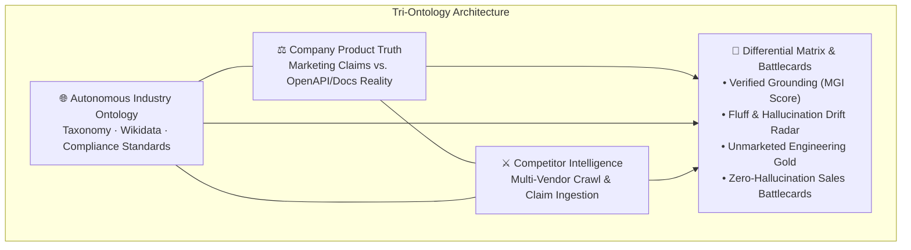

# GainARK OntoLeap (v2.0)
> **Tri-Ontology Marketing Governance, Product Truth Grounding, & Competitive Intelligence for Enterprise B2B SaaS**

[](https://www.python.org/downloads/)
[](https://fastapi.tiangolo.com/)
[](https://github.com/urchade/GLiNER)
[](https://cloud.google.com/run)
[](LICENSE)

---

## 🚀 Live Production Deployment

GainARK OntoLeap is live on **Google Cloud Run**:
- **Executive Dashboard UI**: [https://gainark-ontoleap-35509275124.asia-south1.run.app/dashboard](https://gainark-ontoleap-35509275124.asia-south1.run.app/dashboard)
- **Interactive Swagger API Docs**: [https://gainark-ontoleap-35509275124.asia-south1.run.app/docs](https://gainark-ontoleap-35509275124.asia-south1.run.app/docs)
- **Service Health & Diagnostics**: [https://gainark-ontoleap-35509275124.asia-south1.run.app/api/info](https://gainark-ontoleap-35509275124.asia-south1.run.app/api/info)

---

## 🎯 The Problem Solved

As enterprise AI content generation surges, B2B companies face a severe **Marketing Governance crisis**:
1. **Marketing Drift & Hallucination**: Marketing copy routinely claims compliance standards (e.g. *HIPAA, SOC2*), pricing models (e.g. *Usage-based pricing*), or enterprise integrations (e.g. *NetSuite ERP Sync*) that engineering has never built or verified.
2. **Unmarketed Engineering Gold**: High-value production capabilities and API endpoints remain buried in developer documentation and OpenAPI specs, invisible to prospective buyers.
3. **Superficial Competitive Positioning**: Product marketing teams rely on static, generic battlecards rather than real-time differential truth matrices comparing their engineering truth against competitor claims.

**GainARK OntoLeap** solves this by constructing a **Tri-Ontology Knowledge Graph**:
$$\text{Industry Standards Ontology} \;\cap\; \text{Company Product Truth} \;\cap\; \text{Competitor Intelligence}$$



---

## 🏗️ Core Engines & Architecture

### 1. 🌐 Autonomous Industry Profiler (`industry_profiler.py`)
- **API Endpoint**: `POST /api/discover-industry`
- **Capabilities**: Zero-shot industry vertical discovery for any B2B URL (e.g. *Snyk, Gusto, Ordway*).
- Extracts taxonomy hierarchy, Wikidata entity IDs, regulatory compliance frameworks (SOC2, HIPAA, GDPR, ASC 606), core seed concepts, and direct market competitors.
- Allows 1-click dynamic registration as the active system vertical without restarting the application.

### 2. ⚖️ Dual Ingestion & Product Truth Engine (`product_truth.py`)
- **API Endpoint**: `POST /api/product-truth`
- **Capabilities**: Cross-examines public marketing web copy against technical source truth:
  - **OpenAPI 3.x / Swagger 2.0 Ingestion**: Scans endpoints, HTTP methods, paths, tags, operation summaries, and security schemes (`oauth2`, `bearer`, `apiKey`).
  - **Recursive Technical Docs Crawler**: Recursively explores knowledge bases (Zendesk, Docusaurus, Mintlify) with anti-bot headers to extract production capabilities (`automates`, `integratesWith`, `compliesWith`, `supportsPricingModel`).
  - **Marketing Grounding Index (MGI)**:
    $$MGI = \frac{\text{Verified Marketing Claims}}{\text{Total Marketing Claims}} \times 100$$
  - Emits alerts for **Regulatory Drift**, **Integration Drift**, and **Unmarketed Engineering Gold**.

### 3. ⚔️ Tri-Ontology Competitive Alignment & Battlecards (`competitive_alignment.py`)
- **API Endpoint**: `POST /api/tri-ontology-align`
- **Capabilities**: Multi-competitor differential analysis across the tri-ontology layers:
  - **Company Advantages**: Capabilities verified in your engineering truth that competitors lack or only claim superficially.
  - **Competitor Fluff / Vulnerabilities**: Competitor marketing claims that lack technical verification (prime targets for competitive takedowns).
  - **Table Stakes**: Baseline features shared across all vendors and industry standards.
  - **Gemini 2.5 Flash Battlecards**: Automated synthesis of high-impact sales battlecards with **Attack Angles**, **Killer Discovery Questions**, and **FUD Defenses**.

### 4. 📝 Pre-Publish Marketing Governance Linter & LLM Judge (`validator.py`, `alignment.py`)
- **API Endpoint**: `POST /api/validate-content`
- Real-time pre-publish audit of marketing blogs, landing pages, and press releases.
- Computes **Product-Aligned Score (PAS)**, detects unsubstantiated fluff, calculates penalty deductions, and outputs grounded rewrite recommendations.

### 5. 🕸️ Site Graph, Silo Integrity & GEO Engine (`pipeline.py`, `linking.py`)
- **API Endpoints**: `POST /api/audit`, `POST /api/batch-crawl`, `POST /api/internal-links`, `POST /api/simulate-search`
- High-speed zero-shot entity extraction via **GLiNER Small v2.1** with PyTorch CPU optimization.
- AI Citation Readiness Index (0–100%) evaluating Schema.org coverage, entity density, and topical silo integrity.
- Rule-based relation inference from ontological priors.
- Autonomous `/llms.txt` and `robots.txt` generator for AI search engine discovery (Perplexity, SearchGPT).
- WordPress `the_content` auto-injector filter hook.

---

## 📊 File & Module Map

| File | Layer | Description |
| :--- | :--- | :--- |
| `api.py` | Controller | FastAPI application exposing all REST endpoints, CORS, and request routing. |
| `industry_profiler.py` | Step 1 | Autonomous vertical taxonomy discovery with Gemini 2.5 Flash + Wikidata. |
| `product_truth.py` | Step 2 | Dual-ingestion engine, OpenAPI parser, docs crawler, and Product Truth Matrix. |
| `competitive_alignment.py` | Step 3 | Tri-ontology differential alignment and sales battlecard generation. |
| `templates/dashboard.html` | Step 4 | Unified single-page executive dashboard with 5 interactive views. |
| `pipeline.py` | NLP & Crawl | GLiNER entity extraction, triple extractors, and async sitemap batch crawler. |
| `linking.py` | Knowledge Graph | Topic authority resolution, contextual internal link opportunity matrix. |
| `remediation.py` | Structured Data | Dynamic Schema.org JSON-LD generator (SoftwareApplication, Organization, Offer). |
| `validator.py` | Governance | Google Rich Results validator and PAS compliance scorer. |
| `link_prediction.py` | Graph Completion | Rule-based relation inference over ontological priors. |
| `models.py` | Schema Contracts | Pydantic data models for tri-ontology, triples, battlecards, and site graphs. |
| `verticals/*.json` | Domain Ontologies | Domain-specific taxonomies (Fintech, DevSecOps, Healthcare, HR/Payroll). |
| `Dockerfile` | Deployment | Production container with PyTorch CPU optimization and pre-cached GLiNER model. |

---

## 💻 Local Setup & Quick Start

### Prerequisites
- Python 3.10+ (tested on Python 3.11)
- Git

### 1. Clone & Set Up Environment
```bash
git clone https://github.com/charantech2023/gainark-ontoleap.git
cd gainark-ontoleap

# Create and activate virtual environment
python -m venv venv

# Windows
.\venv\Scripts\activate

# Linux/macOS
source venv/bin/activate

# Install dependencies
pip install -r requirements.txt
```

### 2. Configure Environment Variables
Create a `.env` file in the root directory:
```env
GEMINI_API_KEY="your-gemini-api-key"
GOOGLE_APPLICATION_CREDENTIALS="" # Optional: for Vertex AI / Cloud Run
```

### 3. Run the Application
```bash
python dashboard.py --port 8080
```
- **Web Dashboard**: [http://localhost:8080/dashboard](http://localhost:8080/dashboard)
- **Interactive API Docs**: [http://localhost:8080/docs](http://localhost:8080/docs)

---

## 🧪 Test Suite Execution

GainARK OntoLeap includes end-to-end regression and unit test suites:

```bash
# Test Core API Endpoints
python test_api.py

# Test Autonomous Industry Profiler
python test_industry_profiler.py

# Test Product Truth Dual Ingestion & OpenAPI Parser
python test_product_truth.py

# Test Tri-Ontology Competitive Alignment & Battlecards
python test_competitive_alignment.py
```

---

## 📄 License
This project is licensed under the Apache License 2.0.
